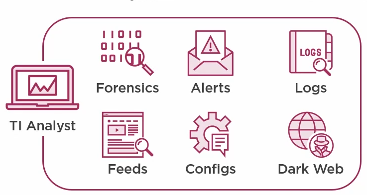

# Intelligence

The goal of threat intelligence is to gather, evaluate and analysis data related to an threat actor.\
with the goal to better insight to the tactic technique and procedure (TTP) to make better decisions on how to mitigate risk to organization.

### Intelligence level

Tactical

* Specific action that can be taken to defend the organisation.

Operational

* Bridges tactical and strategic, by assessing the organization operating environment to identify potential risk.

Strategic

* Define the objectives and guidance on what threat should be mitigated and the security posture of the organization.

### Threat actor

Threat actor is a general term for a person or entity responsible for a cyber attack that impacts the confidentiality, integrity, or availability of an organization's assets. Most often, the term is used to describe individuals and groups that conduct malicious acts against organizations. These threat actors can be categorized as either unintentional or intentional, and internal or external.

## Intelligence process life cycle

### Direction

Understanding the needs of the audience, and define intelligence requirements to address the threat

What assets need to be protected?

### Collection

Gathering of data from different source.

Data in a vacuum, without context, is difficult to interpret and understand, which is why we have multiple sources of data that can be correlated together to create intelligence, by enriching data and providing value by passing the information to the different stakeholders.

#### Collection management framework

Datasheet that explain the source of informations, what we can expect from them, and the question they can help us answer.\
More importantently identify where you are missing sources of information.&#x20;

### Processing

Data is transformed into a understandable format.

#### Rosetta stone

Translation naming schema what the different vendors calls malware, threat actors, etc.. Very helpful to understand different threat reports.

### Analysis

Assessment of the treat TTP based on the data collected.

#### Bias

Everyone has bias, and it important as an analyst to be aware of your own bias, allowing you to counter your biases.

Which is why the CTI team, need to be compromised of multiple different type of people to combat biases.

Cognitive bias [24 Cognitive Biases stuffing up your thinking](https://yourbias.is/)

#### Structured analytic techniques (SAT)

* Decision matrix
* Decision trees

#### Data pivoting / Analytic leaps

1. Start with single indicator
2. Pivot through each data source and add relevant data points
3. Validate, ensure links contain context and ensure the links are meaningful
4. Identify the relevant indicators
5. Be aware of the Kevin bacon effect
   * It takes 6 hops/pivoting to know anyone in the world.

### Dissemination

Distribution of the intelligence report, It important that the report is delivered in such away that the consumer can understand it and apply it to their need.

Traffic light protocol (TLP)

Defined widely recognized threat intel protection level and who it can be shared with.&#x20;

#### Estimative language

Because the meaning of words like likely, might, etc. is highly subjectively, which is why it is important to have an agreed-upon language of the estimate, like a scale

Another good idea is to add percentages to make the meaning clear. e.g. might happen (70%)

### Feedback

Feedback loop for improving the process.

## Intelligence classification

#### Unknown-unknown

Unaware of the existence of a threat

#### Known-unlnown

The threat is known but not understood

#### Known-known

We both know and understand the threat, and resource to put in place to mitigate them.

####
